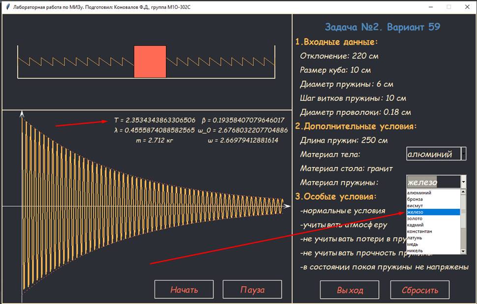

# Simulation-engineering-problems

Моделирование инженерных задач

Имитационная модель реального пружинного маятника

*Примечание: данный репозиторий является публичным и может быть использован в образовательных целях.
             Python можно скачать тут: https://www.python.org/downloads/
             
! После того, как Вы клонируете репозиторий (или же скачаете всё содержимое репозитория одним архивом) необходимо понимать:

      1. В папке "programm" находится файл __main__.py - он является основным.
         Для того, чтобы запустить программу, необходимо установить Python
         (если он не был установлен ранее) и дважды кликнуть ЛКМ по файлу
         __main__.py, тогда программа запустится.

# Что вас ждёт:

